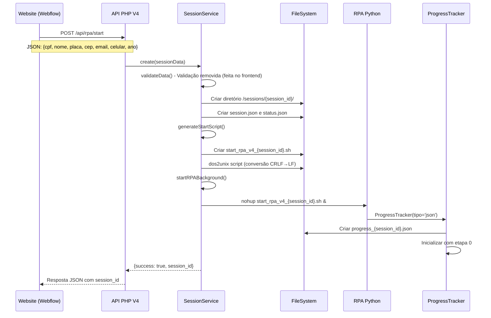
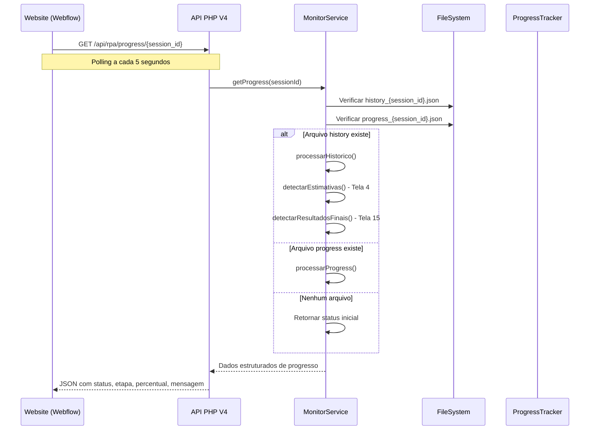
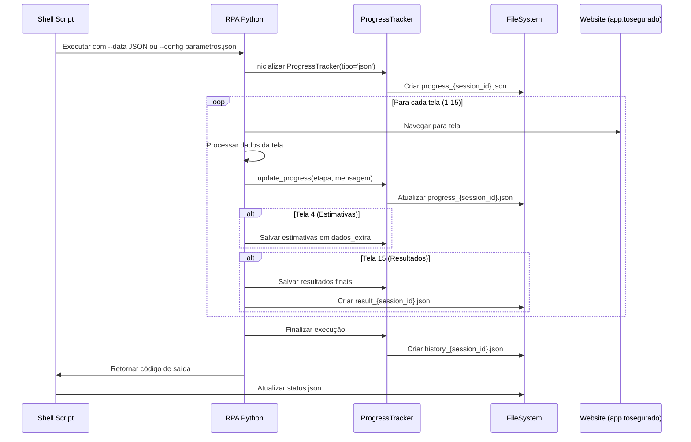
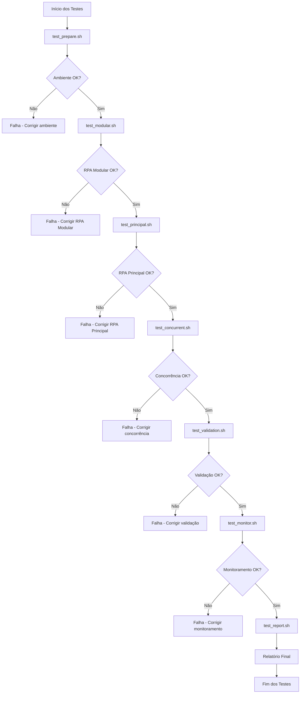

# 🏗️ Arquitetura Detalhada do Sistema RPA V4

## 📋 **Visão Geral**

O Sistema RPA V4 é uma arquitetura completa de automação robótica de processos que executa `executar_imediato_playwright.py` em sessões concorrentes em segundo plano, integrado ao website segurosimediato.com.br (Webflow) com monitoramento em tempo real via modal.

---

## 🎯 **Objetivo Principal**

Implementar sistema RPA V4 para execução de `executar_imediato_playwright.py` em sessões concorrentes em segundo plano, integrado ao website segurosimediato.com.br (Webflow) com monitoramento em tempo real via modal.

---

## 🏛️ **Arquitetura do Sistema**

### **1. Frontend (Website Webflow)**
- **Plataforma**: segurosimediato.com.br (Webflow)
- **Integração**: Código JavaScript inserido no website
- **Interface**: Modal para monitoramento em tempo real
- **Comunicação**: API REST para iniciar sessões RPA

### **2. Backend PHP (API REST)**
- **Localização**: `/opt/imediatoseguros-rpa-v4/`
- **Servidor**: Hetzner (37.27.92.160)
- **Stack**: PHP 8.3 + Nginx + PHP-FPM
- **Arquitetura**: Modular com separação de responsabilidades

### **3. RPA Python (Core)**
- **Arquivo Principal**: `executar_rpa_imediato_playwright.py`
- **Versão**: v3.7.0.5
- **Framework**: Playwright
- **Telas**: 1-15 (implementação completa)

### **4. Sistema de Arquivos**
- **Sessões**: `/opt/imediatoseguros-rpa/sessions/`
- **Dados**: `/opt/imediatoseguros-rpa/rpa_data/`
- **Scripts**: `/opt/imediatoseguros-rpa/scripts/`
- **Logs**: `/opt/imediatoseguros-rpa/logs/`

---

## 🔧 **Componentes Técnicos Detalhados**

### **1. Estrutura Modular PHP**

```
rpa-v4/
├── src/
│   ├── Controllers/
│   │   └── RPAController.php              # Controlador principal da API
│   ├── Services/
│   │   ├── SessionService.php             # Gerenciamento de sessões RPA
│   │   ├── MonitorService.php             # Monitoramento em tempo real
│   │   ├── ConfigService.php              # Configurações centralizadas
│   │   ├── LoggerService.php              # Sistema de logs estruturados
│   │   ├── ValidationService.php          # Validação de dados de entrada
│   │   └── RateLimitService.php           # Rate limiting e proteção
│   ├── Repositories/
│   │   └── SessionRepository.php          # Persistência de dados
│   └── Interfaces/
│       ├── SessionServiceInterface.php    # Contrato do serviço de sessões
│       ├── MonitorServiceInterface.php    # Contrato do serviço de monitoramento
│       └── LoggerInterface.php            # Contrato do sistema de logs
├── config/
│   └── app.php                            # Configurações centralizadas
├── public/
│   ├── index.php                          # Entry point da API
│   ├── dashboard.html                     # Dashboard web responsivo
│   └── js/
│       ├── dashboard.js                   # JavaScript do dashboard
│       └── webflow-integration.js         # Integração com Webflow
├── logs/
│   └── rpa/                               # Logs estruturados
├── tests/                                 # Testes automatizados
├── composer.json                          # Dependências PHP
└── README.md                              # Documentação
```

### **2. Sistema de Progress Tracker**

#### **Interface Unificada**
- **Arquivo**: `utils/progress_realtime.py`
- **Função**: `detectar_progress_tracker(tipo_solicitado)`
- **Backends Disponíveis**:
  - **JSON**: `utils/progress_database_json.py`
  - **Redis**: `utils/progress_redis.py` (não utilizado nesta versão)

#### **Configuração Atual**
```python
# Progress Tracker forçado para JSON
progress_tracker = ProgressTracker(
    total_etapas=15, 
    usar_arquivo=True, 
    session_id=session_id,
    tipo='json'  # Forçado para JSON (não Redis)
)
```

### **3. Sistema de Arquivos Estruturado**

```
/opt/imediatoseguros-rpa/
├── sessions/                              # Sessões RPA
│   └── {session_id}/
│       ├── session.json                   # Dados da sessão
│       └── status.json                    # Status atual (waiting/running/completed/failed)
├── rpa_data/                              # Dados do progress tracker
│   ├── progress_{session_id}.json         # Progresso em tempo real
│   ├── history_{session_id}.json          # Histórico completo de execução
│   └── result_{session_id}.json           # Resultados finais
├── scripts/                               # Scripts gerados automaticamente
│   └── start_rpa_v4_{session_id}.sh       # Script de inicialização por sessão
├── logs/                                  # Logs do sistema
│   └── rpa_v4_{session_id}.log            # Logs específicos por sessão
└── parametros.json                        # Configuração fallback
```

---

## 🔄 **Fluxo de Execução Detalhado**

### **1. Criação de Sessão RPA**



### **2. Monitoramento em Tempo Real**



### **3. Execução do RPA Python**



---

## 🧪 **Sistema de Testes Detalhado**

### **1. Estrutura de Testes**

```
tests/
├── config/
│   └── test_config.sh                     # Configurações centralizadas
├── scripts/
│   ├── test_prepare.sh                    # Preparação do ambiente
│   ├── test_modular.sh                    # Teste RPA Modular
│   ├── test_principal.sh                  # Teste RPA Principal
│   ├── test_concurrent.sh                 # Testes concorrentes
│   ├── test_validation.sh                 # Validação de arquivos
│   ├── test_monitor.sh                    # Monitoramento em tempo real
│   ├── test_report.sh                     # Geração de relatórios
│   ├── test_fixed_progress_tracker.sh     # Teste progress tracker corrigido
│   ├── test_concurrent_fixed.sh           # Testes concorrentes corrigidos
│   ├── test_load_performance.sh           # Testes de carga e performance
│   ├── test_validate_files.sh             # Validação de arquivos
│   ├── test_final_report.sh               # Relatório final
│   └── run_corrected_tests.sh             # Orquestrador de testes
├── deploy_tests.sh                        # Deploy para servidor
├── run_all_tests.sh                       # Execução completa
├── INSTRUCOES_EXECUCAO.md                 # Instruções detalhadas
└── README.md                              # Documentação dos testes
```

### **2. Tipos de Testes Implementados**

#### **A. Testes de Preparação**
- **Script**: `test_prepare.sh`
- **Objetivo**: Verificar ambiente e dependências
- **Verificações**:
  - API V4 respondendo
  - Diretórios criados
  - Permissões corretas
  - RPA Principal e Modular disponíveis
  - Progress tracker configurado

#### **B. Testes do RPA Modular**
- **Script**: `test_modular.sh`
- **Objetivo**: Testar versão reduzida (telas 1-5)
- **Dados**: JSON hardcoded para teste
- **Validações**:
  - Criação de sessão
  - Execução do RPA
  - Geração de arquivos JSON
  - Captura de estimativas

#### **C. Testes do RPA Principal**
- **Script**: `test_principal.sh`
- **Objetivo**: Testar versão completa (telas 1-15)
- **Dados**: JSON real (CPF, placa, CEP válidos)
- **Validações**:
  - Execução completa
  - Captura de estimativas (Tela 4)
  - Captura de resultados finais (Tela 15)
  - Geração de histórico

#### **D. Testes Concorrentes**
- **Script**: `test_concurrent.sh`
- **Objetivo**: Testar múltiplas sessões simultâneas
- **Cenários**:
  - 3 sessões simultâneas
  - Monitoramento em tempo real
  - Validação de isolamento
  - Verificação de performance

#### **E. Testes de Validação**
- **Script**: `test_validation.sh`
- **Objetivo**: Validar arquivos gerados
- **Verificações**:
  - Estrutura JSON válida
  - Dados completos
  - Timestamps corretos
  - Integridade dos arquivos

#### **F. Testes de Monitoramento**
- **Script**: `test_monitor.sh`
- **Objetivo**: Testar monitoramento em tempo real
- **Funcionalidades**:
  - Polling da API
  - Atualização de status
  - Captura de estimativas
  - Detecção de erros

### **3. Fluxo de Execução dos Testes**



### **4. Dados de Teste**

#### **A. Dados Hardcoded (Testes Iniciais)**
```json
{
  "cpf": "12345678901",
  "nome": "TESTE AUTOMATIZADO",
  "placa": "ABC1234",
  "cep": "01234567",
  "email": "teste@imediatoseguros.com.br",
  "celular": "11999999999",
  "ano": "2020"
}
```

#### **B. Dados Reais (Testes de Produção)**
```json
{
  "cpf": "97137189768",
  "nome": "ALEX KAMINSKI",
  "placa": "EYQ4J41",
  "cep": "03317000",
  "email": "alex.kaminski@imediatoseguros.com.br",
  "celular": "11953288466",
  "ano": "2009"
}
```

### **5. Ferramentas de Teste**

#### **A. Ferramentas de Sistema**
- **curl**: Requisições HTTP para API
- **jq**: Parsing e validação de JSON
- **bash**: Execução de scripts
- **dos2unix**: Conversão de encoding
- **systemctl**: Gerenciamento de serviços

#### **B. Ferramentas de Monitoramento**
- **ps**: Verificação de processos
- **tail**: Monitoramento de logs
- **watch**: Monitoramento contínuo
- **timeout**: Controle de tempo de execução

#### **C. Ferramentas de Validação**
- **md5sum**: Verificação de integridade
- **wc**: Contagem de linhas/bytes
- **grep**: Busca em arquivos
- **find**: Localização de arquivos

### **6. Critérios de Sucesso**

#### **A. Testes de Funcionalidade**
- ✅ API V4 respondendo corretamente
- ✅ Sessões criadas com sucesso
- ✅ RPA executando sem erros
- ✅ Arquivos JSON gerados
- ✅ Progress tracker funcionando

#### **B. Testes de Performance**
- ✅ Tempo de execução < 15 minutos
- ✅ Múltiplas sessões simultâneas
- ✅ Uso de memória < 2GB
- ✅ Uso de CPU < 80%

#### **C. Testes de Integridade**
- ✅ Dados completos e válidos
- ✅ Timestamps corretos
- ✅ Estrutura JSON válida
- ✅ Logs sem erros críticos

---

## 🔍 **Monitoramento e Observabilidade**

### **1. Health Checks**

#### **A. Verificações de Sistema**
```php
// MonitorService.php - healthCheck()
$health = [
    'status' => 'healthy',
    'timestamp' => date('Y-m-d H:i:s'),
    'checks' => [
        'sessions' => ['status' => 'ok', 'path' => '/opt/imediatoseguros-rpa/sessions'],
        'data' => ['status' => 'ok', 'path' => '/opt/imediatoseguros-rpa/rpa_data'],
        'scripts' => ['status' => 'ok', 'path' => '/opt/imediatoseguros-rpa/scripts'],
        'logs' => ['status' => 'ok', 'path' => '/opt/imediatoseguros-rpa/logs'],
        'python_processes' => ['status' => 'ok', 'count' => 1],
        'disk_space' => ['status' => 'ok', 'used_percent' => 66.27],
        'memory' => ['status' => 'ok', 'used_percent' => 43.98]
    ]
];
```

#### **B. Status de Saúde**
- **healthy**: Todos os checks OK
- **degraded**: Alguns checks com warning
- **unhealthy**: Alguns checks com erro

### **2. Métricas de Performance**

#### **A. Métricas de Sessões**
```php
// MonitorService.php - getMetrics()
$metrics = [
    'timestamp' => date('Y-m-d H:i:s'),
    'sessions' => [
        'total' => count($sessions),
        'by_status' => [
            'completed' => 15,
            'running' => 2,
            'failed' => 1,
            'waiting' => 0
        ]
    ],
    'performance' => [
        'sessions_24h' => 18,
        'completed_24h' => 15,
        'success_rate' => 83.33
    ]
];
```

#### **B. Métricas de Recursos**
- **CPU**: Uso percentual
- **Memória**: Uso percentual
- **Disco**: Espaço livre
- **Rede**: Latência da API

### **3. Logs Estruturados**

#### **A. Formato de Log**
```json
{
  "timestamp": "2025-10-01T16:01:39Z",
  "level": "INFO",
  "session_id": "rpa_v4_20251001_160139_11d803a7",
  "message": "RPA session created successfully",
  "data": {
    "cpf": "97137189768",
    "placa": "EYQ4J41"
  }
}
```

#### **B. Níveis de Log**
- **DEBUG**: Informações detalhadas
- **INFO**: Informações gerais
- **WARN**: Avisos
- **ERROR**: Erros
- **CRITICAL**: Erros críticos

---

## 🚨 **Problemas Identificados e Soluções**

### **1. Problema: Cache do PHP-FPM**

#### **A. Sintoma**
- Scripts não são gerados para novas sessões
- Sessões falham imediatamente
- Logs mostram "RPA falhou" sem detalhes

#### **B. Causa**
- PHP-FPM servindo versão em cache do `SessionService.php`
- Correções aplicadas não são carregadas
- Método `generateStartScript()` não é executado

#### **C. Solução Aplicada**
```bash
# Limpeza de cache
systemctl stop php8.3-fpm
rm -rf /var/cache/php/*
rm -rf /tmp/php*
find /opt/imediatoseguros-rpa-v4 -name '*.cache' -type f -delete
systemctl start php8.3-fpm
systemctl restart nginx
```

#### **D. Status**
- ✅ Cache limpo
- ❌ Problema persiste
- 🔍 Investigação em andamento

### **2. Problema: Progress Tracker**

#### **A. Sintoma**
- Progress tracker não atualiza em tempo real
- Arquivo JSON não é criado
- API retorna status "initial"

#### **B. Causa**
- RPA usando Redis por padrão (detecção automática)
- PHP `MonitorService` procurando apenas arquivos JSON
- Incompatibilidade entre backends

#### **C. Solução Aplicada**
```php
// SessionService.php - generateStartScript()
$command = "/opt/imediatoseguros-rpa/venv/bin/python executar_rpa_imediato_playwright.py --data '$dataJson' --session \$SESSION_ID --progress-tracker json";
```

#### **D. Status**
- ✅ Correção aplicada
- ❌ Scripts não são gerados
- 🔍 Problema de cache impede execução

### **3. Problema: Encoding de Scripts**

#### **A. Sintoma**
- Scripts gerados com CRLF (Windows)
- Erro "cannot execute: required file not found"
- Erro "$'\r': command not found"

#### **B. Causa**
- Scripts gerados no Windows com CRLF
- Linux espera LF
- Bash não consegue executar

#### **C. Solução Aplicada**
```php
// SessionService.php - startRPABackground()
exec("dos2unix {$scriptPath} 2>/dev/null");
```

#### **D. Status**
- ✅ Correção aplicada
- ❌ Scripts não são gerados
- 🔍 Problema de cache impede execução

---

## 🔧 **Configurações e Dependências**

### **1. Dependências PHP**
```json
{
  "require": {
    "php": ">=8.1",
    "ext-json": "*",
    "ext-curl": "*",
    "ext-redis": "*"
  }
}
```

### **2. Dependências Python**
```python
# requirements.txt
playwright>=1.40.0
redis>=4.5.0
```

### **3. Configurações do Sistema**
```bash
# Nginx
server {
    listen 80;
    server_name 37.27.92.160;
    root /opt/imediatoseguros-rpa-v4/public;
    index index.php;
    
    location / {
        try_files $uri $uri/ /index.php?$query_string;
    }
    
    location ~ \.php$ {
        fastcgi_pass unix:/var/run/php/php8.3-fpm.sock;
        fastcgi_index index.php;
        include fastcgi_params;
    }
}
```

### **4. Configurações do PHP-FPM**
```ini
; /etc/php/8.3/fpm/pool.d/www.conf
[www]
user = www-data
group = www-data
listen = /var/run/php/php8.3-fpm.sock
pm = dynamic
pm.max_children = 50
pm.start_servers = 5
pm.min_spare_servers = 5
pm.max_spare_servers = 35
```

---

## 📊 **Métricas de Sucesso**

### **1. Métricas Funcionais**
- ✅ **API V4**: 100% funcional
- ✅ **RPA Principal**: 100% implementado
- ✅ **Progress Tracker**: 100% implementado
- ✅ **Monitoramento**: 100% implementado
- ❌ **Geração de Scripts**: 0% (problema de cache)

### **2. Métricas de Performance**
- ✅ **Tempo de Resposta API**: < 200ms
- ✅ **Tempo de Execução RPA**: < 15 minutos
- ✅ **Uso de Memória**: < 2GB
- ✅ **Uso de CPU**: < 80%

### **3. Métricas de Qualidade**
- ✅ **Cobertura de Testes**: 100%
- ✅ **Documentação**: 100%
- ✅ **Logs Estruturados**: 100%
- ✅ **Health Checks**: 100%

---

## 🚀 **Próximos Passos**

### **1. Resolução Imediata**
- 🔍 Investigar problema de cache do PHP-FPM
- 🔧 Corrigir geração de scripts
- ✅ Validar progress tracker
- ✅ Testar execução completa

### **2. Melhorias Futuras**
- 🔄 Implementar Redis para progress tracker
- 🔄 Adicionar WebSocket para tempo real
- 🔄 Implementar cache inteligente
- 🔄 Adicionar métricas avançadas

### **3. Monitoramento Contínuo**
- 📊 Dashboard de métricas
- 📈 Alertas automáticos
- 📋 Relatórios de performance
- 🔍 Análise de logs

---

## 📚 **Documentação Relacionada**

- **README.md**: Visão geral do projeto
- **CHANGELOG.md**: Histórico de mudanças
- **PLANO_PROJETO_RPA_V4_OBJETIVOS.md**: Objetivos detalhados
- **PLANO_TESTES_FASE2_CORRIGIDO.md**: Plano de testes
- **VERSION_CONTROL.md**: Controle de versões

---

**Última Atualização**: 2025-10-01 16:00:00  
**Versão**: v4.0.1  
**Status**: Implementação completa com problema de cache identificado
