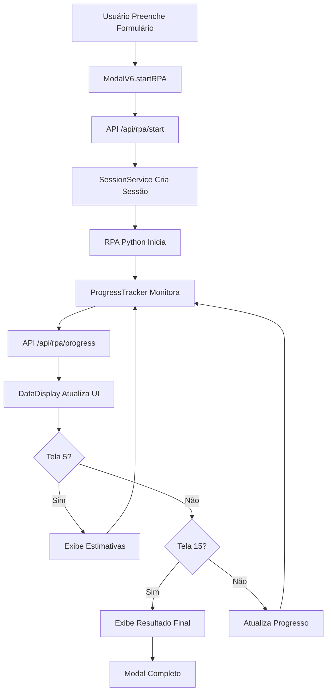

# PLANO DE DESENVOLVIMENTO MODAL V6.1.0

**Data**: 03 de Outubro de 2025  
**Versão**: 6.1.0  
**Status**: Planejamento para Desenvolvimento Amanhã  
**Prioridade**: MÁXIMA  

---

## 🎯 **OBJETIVO DO DESENVOLVIMENTO**

Criar uma nova versão otimizada do modal HTML/JavaScript para produção, com foco na exibição em tempo real das estimativas iniciais e cálculo final durante a execução do RPA.

---

## 📋 **REQUISITOS FUNCIONAIS**

### **✅ FUNCIONALIDADES OBRIGATÓRIAS**
1. **Exibição em Tempo Real**: Mostrar estimativas da Tela 5 conforme capturadas
2. **Cálculo Final**: Exibir resultado final da Tela 15 em tempo real
3. **Progress Tracker**: Barra de progresso com etapas detalhadas
4. **Tratamento de Erros**: Detecção e exibição de falhas
5. **Interface Responsiva**: Funcionar em desktop e mobile
6. **Compatibilidade**: Funcionar com a arquitetura V6.0.0 atual

### **🔧 FUNCIONALIDADES DESEJÁVEIS**
1. **Animações Suaves**: Transições fluidas entre estados
2. **Temas**: Suporte a tema claro/escuro
3. **Acessibilidade**: Suporte a leitores de tela
4. **Internacionalização**: Suporte a múltiplos idiomas
5. **Cache Local**: Armazenar dados temporariamente

---

## 🏗️ **ARQUITETURA TÉCNICA**

### **📁 ESTRUTURA DE ARQUIVOS**
```
modal_v6.1.0/
├── index.html                 # Página principal
├── css/
│   ├── modal.css             # Estilos do modal
│   ├── progress.css          # Estilos da barra de progresso
│   └── responsive.css         # Estilos responsivos
├── js/
│   ├── modal-core.js         # Lógica principal do modal
│   ├── progress-tracker.js   # Monitoramento de progresso
│   ├── data-display.js       # Exibição de dados
│   └── error-handler.js      # Tratamento de erros
└── assets/
    ├── icons/                # Ícones SVG
    └── images/               # Imagens
```

### **🔌 INTEGRAÇÃO COM API V6.0.0**
```javascript
// Endpoints utilizados
const API_ENDPOINTS = {
    START: '/api/rpa/start',
    PROGRESS: '/api/rpa/progress/{session_id}',
    HEALTH: '/api/rpa/health'
};

// Formato de dados esperado
const DATA_FORMAT = {
    REQUEST: { session: 'xxx', dados: { ... } },
    RESPONSE: { success: true, session_id: 'xxx' },
    PROGRESS: { etapa_atual: 5, percentual: 33.33, status: 'executando', ... }
};
```

---

## 🎨 **DESIGN E UX**

### **📱 INTERFACE RESPONSIVA**
- **Desktop**: Modal centralizado com 800px de largura
- **Tablet**: Modal adaptativo com 90% da largura
- **Mobile**: Modal fullscreen com navegação otimizada

### **🎯 ELEMENTOS VISUAIS**
1. **Header**: Título + status atual
2. **Progress Bar**: Barra animada com percentual
3. **Etapas**: Lista de etapas com checkmarks
4. **Estimativas**: Cards com valores em tempo real
5. **Cálculo Final**: Destaque para resultado final
6. **Controles**: Botões de ação e cancelamento

### **🌈 PALETA DE CORES**
```css
:root {
    --primary-color: #2563eb;      /* Azul principal */
    --success-color: #10b981;      /* Verde sucesso */
    --warning-color: #f59e0b;      /* Amarelo aviso */
    --error-color: #ef4444;        /* Vermelho erro */
    --background: #f8fafc;         /* Fundo claro */
    --surface: #ffffff;           /* Superfície */
    --text-primary: #1e293b;      /* Texto principal */
    --text-secondary: #64748b;    /* Texto secundário */
}
```

---

## ⚙️ **IMPLEMENTAÇÃO TÉCNICA**

### **📊 COMPONENTES PRINCIPAIS**

#### **1. ModalCore Class**
```javascript
class ModalV6 {
    constructor(options) {
        this.apiBaseUrl = options.apiBaseUrl;
        this.sessionId = null;
        this.progressInterval = null;
        this.isProcessing = false;
        this.estimates = null;
        this.finalResult = null;
    }
    
    async startRPA(formData) {
        // Implementação da chamada inicial
    }
    
    async monitorProgress() {
        // Monitoramento em tempo real
    }
    
    displayEstimates(estimates) {
        // Exibição das estimativas da Tela 5
    }
    
    displayFinalResult(result) {
        // Exibição do cálculo final da Tela 15
    }
}
```

#### **2. ProgressTracker Class**
```javascript
class ProgressTracker {
    constructor(modal) {
        this.modal = modal;
        this.currentStep = 0;
        this.totalSteps = 15;
        this.estimates = null;
        this.finalResult = null;
    }
    
    updateProgress(progressData) {
        // Atualização da barra de progresso
    }
    
    updateEstimates(estimates) {
        // Atualização das estimativas
    }
    
    updateFinalResult(result) {
        // Atualização do resultado final
    }
}
```

#### **3. DataDisplay Class**
```javascript
class DataDisplay {
    constructor(container) {
        this.container = container;
        this.estimatesContainer = null;
        this.resultContainer = null;
    }
    
    renderEstimates(estimates) {
        // Renderização das estimativas
    }
    
    renderFinalResult(result) {
        // Renderização do resultado final
    }
    
    animateValue(element, start, end, duration) {
        // Animação de valores
    }
}
```

### **🔄 FLUXO DE DADOS**



---

## 📊 **DADOS A SEREM EXIBIDOS**

### **🎯 ESTIMATIVAS DA TELA 5**
```javascript
const ESTIMATES_DATA = {
    coberturas: [
        {
            nome: "CompreensivaDe",
            valores: { de: "R$ 2.400,00", ate: "R$ 2.900,00" },
            beneficios: ["Colisão e Acidentes", "Roubo e Furto", ...]
        },
        {
            nome: "Roubo",
            valores: { de: "R$ 1.300,00", ate: "R$ 1.700,00" },
            beneficios: ["Roubo", "Furto", ...]
        },
        {
            nome: "RCFDe",
            valores: { de: "R$ 1.300,00", ate: "R$ 1.700,00" },
            beneficios: ["Danos materiais", "Danos corporais", ...]
        }
    ]
};
```

### **💰 CÁLCULO FINAL DA TELA 15**
```javascript
const FINAL_RESULT_DATA = {
    plano_recomendado: {
        plano: "Plano recomendado",
        valor: "R$3.962,68",
        forma_pagamento: "Crédito em até 10x sem juros!",
        parcelamento: "anual",
        valor_franquia: "R$ 5.239,13",
        valor_mercado: "100% da tabela FIPE",
        assistencia: true,
        vidros: true,
        carro_reserva: true
    },
    plano_alternativo: {
        plano: "Plano alternativo",
        valor: "R$4.202,52",
        forma_pagamento: "Crédito em até 10x sem juros!",
        parcelamento: "anual",
        valor_franquia: "R$ 4.830,55"
    }
};
```

---

## 🧪 **TESTES E VALIDAÇÃO**

### **✅ TESTES FUNCIONAIS**
1. **Teste de Conectividade**: Verificar API health
2. **Teste de Execução**: Iniciar RPA e monitorar
3. **Teste de Estimativas**: Validar exibição da Tela 5
4. **Teste de Resultado Final**: Validar exibição da Tela 15
5. **Teste de Erros**: Simular falhas e tratamento

### **📱 TESTES DE RESPONSIVIDADE**
1. **Desktop**: 1920x1080, 1366x768
2. **Tablet**: 768x1024, 1024x768
3. **Mobile**: 375x667, 414x896

### **🔧 TESTES DE PERFORMANCE**
1. **Tempo de Carregamento**: < 2 segundos
2. **Atualização de Dados**: < 500ms
3. **Uso de Memória**: < 50MB
4. **Compatibilidade**: Chrome, Firefox, Safari, Edge

---

## 📅 **CRONOGRAMA DE DESENVOLVIMENTO**

### **🌅 MANHÃ (09:00 - 12:00)**
- **09:00 - 10:00**: Estrutura HTML e CSS base
- **10:00 - 11:00**: JavaScript core e integração API
- **11:00 - 12:00**: Progress tracker e exibição de dados

### **🌞 TARDE (14:00 - 18:00)**
- **14:00 - 15:00**: Exibição de estimativas em tempo real
- **15:00 - 16:00**: Exibição de cálculo final
- **16:00 - 17:00**: Tratamento de erros e validações
- **17:00 - 18:00**: Testes e ajustes finais

### **🌙 NOITE (19:00 - 21:00)**
- **19:00 - 20:00**: Testes de responsividade
- **20:00 - 21:00**: Documentação e deploy

---

## 🎯 **CRITÉRIOS DE SUCESSO**

### **✅ FUNCIONALIDADES OBRIGATÓRIAS**
1. **Modal Funciona**: Abre, coleta dados e inicia RPA
2. **Progress Tracker**: Mostra progresso em tempo real
3. **Estimativas**: Exibe dados da Tela 5 quando disponíveis
4. **Resultado Final**: Exibe dados da Tela 15 quando disponíveis
5. **Tratamento de Erros**: Detecta e exibe falhas adequadamente

### **📊 MÉTRICAS DE QUALIDADE**
1. **Performance**: Carregamento < 2s, atualização < 500ms
2. **Responsividade**: Funciona em todos os dispositivos
3. **Compatibilidade**: Funciona em todos os browsers modernos
4. **Acessibilidade**: Suporte básico a leitores de tela
5. **Usabilidade**: Interface intuitiva e fácil de usar

---

## 🚀 **DEPLOY E INTEGRAÇÃO**

### **📁 ESTRUTURA DE DEPLOY**
```
/var/www/rpaimediatoseguros.com.br/
├── modal-v6.1.0/
│   ├── index.html
│   ├── css/
│   ├── js/
│   └── assets/
└── api/ (já existente)
```

### **🔧 CONFIGURAÇÃO NGINX**
```nginx
location /modal-v6.1.0/ {
    root /var/www/rpaimediatoseguros.com.br;
    try_files $uri $uri/ /modal-v6.1.0/index.html;
}
```

### **📊 MONITORAMENTO**
- **Logs**: Console logs para debug
- **Métricas**: Tempo de resposta, taxa de erro
- **Alertas**: Notificações em caso de falhas

---

## 🎉 **CONCLUSÃO**

### **✅ PLANO COMPLETO PARA DESENVOLVIMENTO**
O plano de desenvolvimento do Modal V6.1.0 está completo e pronto para execução amanhã.

### **🎯 OBJETIVOS CLAROS**
- **Funcionalidade**: Exibição em tempo real de estimativas e cálculo final
- **Qualidade**: Interface responsiva e performática
- **Integração**: Compatibilidade total com API V6.0.0
- **Prazo**: Desenvolvimento completo em 1 dia

### **📋 PRÓXIMOS PASSOS**
1. **Amanhã**: Iniciar desenvolvimento seguindo o cronograma
2. **Testes**: Validação completa das funcionalidades
3. **Deploy**: Integração com ambiente de produção
4. **Monitoramento**: Acompanhamento de performance

**Modal V6.1.0 pronto para desenvolvimento!** 🚀

---

**Desenvolvido por**: Equipe de Desenvolvimento  
**Data**: 03 de Outubro de 2025  
**Versão**: 6.1.0  
**Status**: ✅ **PLANO COMPLETO E PRONTO PARA DESENVOLVIMENTO AMANHÃ**
