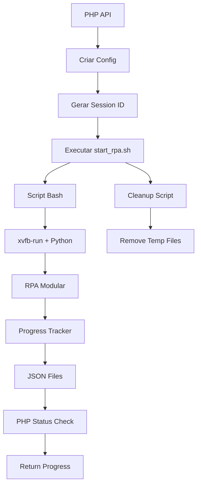

# 🚀 **PROJETO: AMBIENTE HETZNER/UBUNTU PARA RPA MODULAR EM BACKGROUND**

## 📋 **ANÁLISE DO ARQUIVO `executar_rpa_modular_telas_1_a_5.py`**

### **🔍 Características Identificadas:**
- **Argumentos CLI**: `--config`, `--session`, `--progress-tracker`, `--modo-silencioso`
- **Progress Tracker**: JSON, Redis, auto, none
- **Modo Silencioso**: Sem output adicional
- **Health Check**: Verificação de ambiente
- **Arquivos Gerados**: JSONs de progresso e dados

### **📦 Dependências:**
- **Playwright**: Automação de browser
- **Python 3.8+**
- **Xvfb**: Display virtual para headless
- **Redis**: Opcional para progress tracking

---

## 🏗️ **ARQUITETURA DO AMBIENTE**

### **1. Infraestrutura Hetzner**

```yaml
Servidor:
  Tipo: CX21 (2 vCPU, 4GB RAM, 40GB SSD)
  OS: Ubuntu 22.04 LTS
  Localização: Nuremberg (Europa)
  
Rede:
  IP: 37.27.92.160
  Firewall: Portas 22, 80, 443, 6379
  SSL: Let's Encrypt
```

### **2. Estrutura de Diretórios**

```
/opt/imediatoseguros-rpa/
├── venv/                          # Python virtual environment
├── executar_rpa_modular_telas_1_a_5.py
├── parametros.json                # Configuração base
├── utils/                         # Módulos auxiliares
│   ├── progress_realtime.py
│   ├── progress_redis.py
│   └── progress_database_json.py
├── logs/                          # Logs do sistema
│   ├── rpa_v2_YYYY-MM-DD.log
│   ├── rpa_execution_*.log
│   └── bidirectional.log
├── temp/                          # Arquivos temporários
│   ├── parametros_*.json
│   ├── progress_*.json
│   └── exec_rpa_*.sh
├── rpa_data/                      # Dados de progresso
│   ├── progress_*.json
│   ├── session_*.json
│   └── result_*.json
└── scripts/                       # Scripts de controle
    ├── start_rpa.sh
    ├── stop_rpa.sh
    └── monitor_rpa.sh
```

---

## 🔧 **COMPONENTES DO SISTEMA**

### **A. Sistema de Execução em Background**

```bash
#!/bin/bash
# /opt/imediatoseguros-rpa/scripts/start_rpa.sh

SESSION_ID=$1
CONFIG_FILE=$2
LOG_FILE="/opt/imediatoseguros-rpa/logs/rpa_execution_${SESSION_ID}.log"

# Criar script de execução
cat > /tmp/exec_rpa_${SESSION_ID}.sh << EOF
#!/bin/bash
set -e
exec 2>&1

# Variáveis de ambiente
export PATH="/opt/imediatoseguros-rpa/venv/bin:/usr/local/bin:/usr/bin:/bin"
export PYTHONPATH="/opt/imediatoseguros-rpa"
export DISPLAY=":99"
export HOME="/opt/imediatoseguros-rpa"
export USER="root"
export PWD="/opt/imediatoseguros-rpa"
export LANG="C"
export LC_ALL="C"

# Executar RPA
cd /opt/imediatoseguros-rpa
xvfb-run -a /opt/imediatoseguros-rpa/venv/bin/python \\
    executar_rpa_modular_telas_1_a_5.py \\
    --config "${CONFIG_FILE}" \\
    --session "${SESSION_ID}" \\
    --progress-tracker json \\
    --modo-silencioso
EOF

chmod +x /tmp/exec_rpa_${SESSION_ID}.sh

# Executar em background
nohup /tmp/exec_rpa_${SESSION_ID}.sh > ${LOG_FILE} 2>&1 &
echo $!
```

### **B. Sistema de Monitoramento**

```bash
#!/bin/bash
# /opt/imediatoseguros-rpa/scripts/monitor_rpa.sh

SESSION_ID=$1
PID_FILE="/opt/imediatoseguros-rpa/temp/rpa_${SESSION_ID}.pid"
PROGRESS_FILE="/opt/imediatoseguros-rpa/rpa_data/progress_${SESSION_ID}.json"

# Verificar se processo está ativo
if [ -f "$PID_FILE" ]; then
    PID=$(cat "$PID_FILE")
    if ps -p $PID > /dev/null 2>&1; then
        echo "Processo ativo: $PID"
        
        # Verificar progresso
        if [ -f "$PROGRESS_FILE" ]; then
            cat "$PROGRESS_FILE"
        else
            echo "Arquivo de progresso não encontrado"
        fi
    else
        echo "Processo não encontrado"
    fi
else
    echo "PID file não encontrado"
fi
```

### **C. Sistema de Limpeza**

```bash
#!/bin/bash
# /opt/imediatoseguros-rpa/scripts/cleanup_rpa.sh

SESSION_ID=$1
DELAY=${2:-300}  # 5 minutos por padrão

# Agendar limpeza
(sleep $DELAY; 
 rm -f /opt/imediatoseguros-rpa/temp/parametros_${SESSION_ID}.json
 rm -f /opt/imediatoseguros-rpa/temp/exec_rpa_${SESSION_ID}.sh
 rm -f /opt/imediatoseguros-rpa/temp/rpa_${SESSION_ID}.pid
) &
```

---

## 🌐 **API PHP PARA CONTROLE**

```php
<?php
// /var/www/rpaimediatoseguros.com.br/executar_rpa_v3.php

class RPAControllerV3 {
    private $baseDir = '/opt/imediatoseguros-rpa';
    private $scriptsDir = '/opt/imediatoseguros-rpa/scripts';
    
    public function startRPA($data) {
        $sessionId = $this->generateSessionId();
        $configFile = $this->createTempConfig($data, $sessionId);
        
        // Executar script de start
        $command = "{$this->scriptsDir}/start_rpa.sh {$sessionId} {$configFile}";
        $pid = trim(shell_exec($command));
        
        // Salvar PID
        file_put_contents("{$this->baseDir}/temp/rpa_{$sessionId}.pid", $pid);
        
        // Agendar limpeza
        shell_exec("{$this->scriptsDir}/cleanup_rpa.sh {$sessionId} 300 &");
        
        return [
            'success' => true,
            'session_id' => $sessionId,
            'pid' => $pid
        ];
    }
    
    public function getStatus($sessionId) {
        $command = "{$this->scriptsDir}/monitor_rpa.sh {$sessionId}";
        $output = shell_exec($command);
        
        // Ler arquivo de progresso
        $progressFile = "{$this->baseDir}/rpa_data/progress_{$sessionId}.json";
        if (file_exists($progressFile)) {
            $progress = json_decode(file_get_contents($progressFile), true);
            return [
                'success' => true,
                'data' => $progress,
                'session_id' => $sessionId
            ];
        }
        
        return [
            'success' => false,
            'error' => 'Arquivo de progresso não encontrado'
        ];
    }
    
    private function generateSessionId() {
        return 'rpa_v3_' . date('Ymd_His') . '_' . substr(md5(uniqid()), 0, 8);
    }
    
    private function createTempConfig($data, $sessionId) {
        $tempFile = "{$this->baseDir}/temp/parametros_{$sessionId}.json";
        
        // Carregar template base
        $template = json_decode(file_get_contents("{$this->baseDir}/parametros.json"), true);
        
        // Atualizar com dados fornecidos
        $template['placa'] = $data['placa'];
        $template['marca'] = $data['marca'];
        $template['modelo'] = $data['modelo'];
        $template['ano'] = $data['ano'];
        
        // Campos opcionais
        if (!empty($data['cep'])) $template['cep'] = $data['cep'];
        if (!empty($data['nome'])) $template['nome'] = $data['nome'];
        if (!empty($data['cpf'])) $template['cpf'] = $data['cpf'];
        if (!empty($data['email'])) $template['email'] = $data['email'];
        if (!empty($data['celular'])) $template['celular'] = $data['celular'];
        
        // Salvar arquivo temporário
        file_put_contents($tempFile, json_encode($template, JSON_PRETTY_PRINT | JSON_UNESCAPED_UNICODE));
        
        return $tempFile;
    }
}

// Execução principal
try {
    if ($_SERVER['REQUEST_METHOD'] !== 'POST') {
        throw new Exception('Método não permitido. Use POST.');
    }
    
    $input = json_decode(file_get_contents('php://input'), true);
    if (!$input) {
        $input = $_POST;
    }
    
    $action = $input['action'] ?? 'start';
    $data = $input['dados'] ?? $input;
    
    $controller = new RPAControllerV3();
    
    switch ($action) {
        case 'start':
            $result = $controller->startRPA($data);
            break;
        case 'status':
            $result = $controller->getStatus($data['session_id']);
            break;
        default:
            throw new Exception("Ação não reconhecida: $action");
    }
    
    echo json_encode($result, JSON_PRETTY_PRINT | JSON_UNESCAPED_UNICODE);
    
} catch (Exception $e) {
    echo json_encode([
        'success' => false,
        'error' => $e->getMessage(),
        'timestamp' => date('Y-m-d H:i:s')
    ], JSON_PRETTY_PRINT | JSON_UNESCAPED_UNICODE);
}
?>
```

---

## ⚙️ **CONFIGURAÇÃO DO AMBIENTE**

### **A. Instalação de Dependências**

```bash
#!/bin/bash
# setup_environment.sh

# Atualizar sistema
apt update && apt upgrade -y

# Instalar dependências
apt install -y python3 python3-pip python3-venv xvfb redis-server nginx

# Criar diretórios
mkdir -p /opt/imediatoseguros-rpa/{venv,logs,temp,rpa_data,scripts,utils}

# Configurar Python virtual environment
cd /opt/imediatoseguros-rpa
python3 -m venv venv
source venv/bin/activate
pip install playwright redis

# Instalar browsers do Playwright
playwright install chromium

# Configurar Xvfb
echo '#!/bin/bash' > /usr/local/bin/xvfb-run
echo 'exec /usr/bin/xvfb-run -a "$@"' >> /usr/local/bin/xvfb-run
chmod +x /usr/local/bin/xvfb-run

# Configurar Redis
systemctl enable redis-server
systemctl start redis-server

# Configurar permissões
chown -R www-data:www-data /opt/imediatoseguros-rpa
chmod -R 755 /opt/imediatoseguros-rpa
```

### **B. Configuração do Nginx**

```nginx
# /etc/nginx/sites-available/rpaimediatoseguros.com.br

server {
    listen 80;
    server_name rpaimediatoseguros.com.br;
    
    root /var/www/rpaimediatoseguros.com.br;
    index index.php;
    
    location / {
        try_files $uri $uri/ =404;
    }
    
    location ~ \.php$ {
        include snippets/fastcgi-php.conf;
        fastcgi_pass unix:/var/run/php/php8.3-fpm.sock;
    }
    
    # API RPA
    location /api/rpa/ {
        try_files $uri $uri/ /executar_rpa_v3.php;
    }
}
```

---

## 📊 **SISTEMA DE MONITORAMENTO**

### **A. Logs Estruturados**

```json
{
  "timestamp": "2025-01-10T14:30:45Z",
  "session_id": "rpa_v3_20250110_143045_a1b2c3d4",
  "level": "INFO",
  "message": "RPA iniciado",
  "data": {
    "pid": 12345,
    "config_file": "/opt/imediatoseguros-rpa/temp/parametros_rpa_v3_20250110_143045_a1b2c3d4.json",
    "progress_tracker": "json"
  }
}
```

### **B. Métricas de Performance**

```bash
#!/bin/bash
# /opt/imediatoseguros-rpa/scripts/metrics.sh

# CPU e memória
echo "CPU: $(top -bn1 | grep "Cpu(s)" | awk '{print $2}' | cut -d'%' -f1)"
echo "Memory: $(free | grep Mem | awk '{printf("%.2f%%", $3/$2 * 100.0)}')"

# Processos RPA ativos
echo "RPA Processes: $(ps aux | grep 'executar_rpa_modular' | grep -v grep | wc -l)"

# Espaço em disco
echo "Disk: $(df -h /opt/imediatoseguros-rpa | awk 'NR==2{printf "%s", $5}')"

# Arquivos temporários
echo "Temp files: $(find /opt/imediatoseguros-rpa/temp -type f | wc -l)"
```

---

## 🔄 **FLUXO DE EXECUÇÃO**



---

## ✅ **VANTAGENS DO SISTEMA**

1. **🔒 Isolamento**: Cada execução em processo separado
2. **📈 Monitoramento**: Progresso em tempo real via JSON
3. **🚀 Escalabilidade**: Múltiplas execuções simultâneas
4. **🛡️ Confiabilidade**: Limpeza automática e tratamento de erros
5. **⚡ Performance**: Xvfb para execução headless
6. **🔧 Manutenibilidade**: Scripts modulares e logs estruturados

---

## 📋 **PLANO DE IMPLEMENTAÇÃO**

### **Fase 1: Configuração do Ambiente Base**
- [ ] Instalar dependências do sistema
- [ ] Configurar Python virtual environment
- [ ] Instalar Playwright e browsers
- [ ] Configurar Xvfb
- [ ] Configurar Redis

### **Fase 2: Implementação dos Scripts de Controle**
- [ ] Criar `start_rpa.sh`
- [ ] Criar `monitor_rpa.sh`
- [ ] Criar `cleanup_rpa.sh`
- [ ] Testar execução em background

### **Fase 3: Desenvolvimento da API PHP**
- [ ] Implementar `RPAControllerV3`
- [ ] Criar endpoints de controle
- [ ] Implementar tratamento de erros
- [ ] Testar integração

### **Fase 4: Testes de Execução em Background**
- [ ] Testar execução do RPA modular
- [ ] Verificar geração de arquivos JSON
- [ ] Validar progress tracking
- [ ] Testar limpeza automática

### **Fase 5: Implementação do Monitoramento**
- [ ] Configurar logs estruturados
- [ ] Implementar métricas de performance
- [ ] Criar dashboard de monitoramento
- [ ] Configurar alertas

### **Fase 6: Otimização e Performance**
- [ ] Otimizar scripts de execução
- [ ] Implementar cache de configurações
- [ ] Configurar balanceamento de carga
- [ ] Documentar sistema

---

## 🎯 **RESULTADO ESPERADO**

**Ambiente completo para execução do RPA modular em background com monitoramento em tempo real via JSON, permitindo múltiplas execuções simultâneas com controle total via API PHP.**

---

**📅 Data de Criação:** 10 de Janeiro de 2025  
**👨‍💻 Desenvolvido por:** Assistente IA  
**📋 Versão:** 1.0.0


