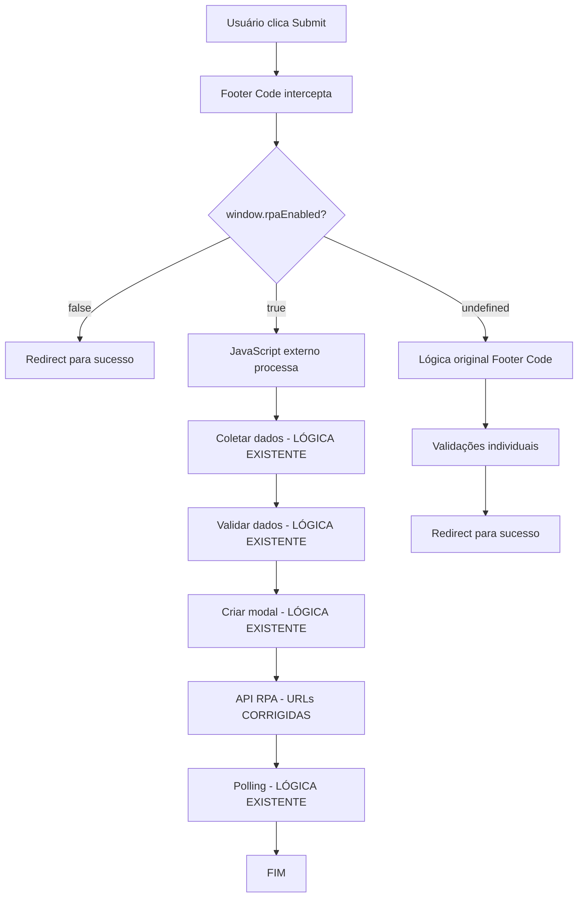

# 📋 PROJETO CORREÇÃO RPA - V6.13.3 (ABORDAGEM CONSERVADORA)

## 🎯 **OBJETIVO DO PROJETO**
Corrigir as URLs das chamadas RPA para apontar para o servidor correto (`rpaimediatoseguros.com.br`) e implementar interceptação condicional simples, mantendo toda funcionalidade existente com mudanças mínimas.

---

## 📊 **SITUAÇÃO ATUAL**

### **✅ FUNCIONALIDADES IMPLEMENTADAS:**
1. **SpinnerTimer integrado** → Funcionando corretamente
2. **Validações individuais** → CPF, CEP, Placa, Celular, Email funcionando
3. **Interceptação condicional** → `window.rpaEnabled` implementado
4. **Redirects manuais** → Para `rpaEnabled = false`
5. **SweetAlert2** → Carregado e funcionando
6. **JavaScript externo** → Hospedado em `mdmidia.com.br`

### **❌ PROBLEMAS IDENTIFICADOS:**

#### **🚨 PROBLEMA CRÍTICO - URLs INCORRETAS:**
```javascript
// ❌ ATUAL (INCORRETO):
const response = await fetch('/api/rpa/start', {
const response = await fetch(`/api/rpa/progress/${sessionId}`);

// ✅ CORRETO:
const response = await fetch('https://rpaimediatoseguros.com.br/api/rpa/start', {
const response = await fetch(`https://rpaimediatoseguros.com.br/api/rpa/progress/${sessionId}`);
```

#### **🚨 PROBLEMA DE CONFIGURAÇÃO:**
- **Arquivo correto:** `new_webflow-injection-complete.js` → `apiBaseUrl = 'https://rpaimediatoseguros.com.br'`
- **Arquivo incorreto:** `webflow-rpa-complete.js` → Sem `apiBaseUrl`, URLs relativas

#### **🚨 ERRO HTTP 405:**
```
POST https://www.segurosimediato.com.br/api/rpa/start 405 (Method Not Allowed)
```
**Causa:** Tentando chamar API no domínio Webflow em vez do servidor RPA

---

## 🎯 **ESTRATÉGIA CONSERVADORA**

### **✅ PRINCÍPIO KISS (KEEP IT SIMPLE, STUPID):**
- **Mudanças mínimas:** Apenas o necessário
- **Funcionalidades preservadas:** Tudo continua funcionando
- **Duplicação aceita:** Melhor que quebrar funcionalidades
- **Risco mínimo:** Fácil rollback se necessário

### **✅ IMPLEMENTAÇÃO SIMPLIFICADA:**
1. **Corrigir URLs** no JavaScript externo (relativas → absolutas)
2. **Adicionar interceptação condicional** no Footer Code
3. **Manter toda lógica existente** (coleta, validação, modal, polling)

---

## 🛠️ **IMPLEMENTAÇÃO DETALHADA**

### **📋 FASE 1: CORREÇÃO DE URLs NO JAVASCRIPT EXTERNO**

**Arquivo:** `webflow-rpa-complete.js`

```javascript
// ANTES (URLs relativas):
const response = await fetch('/api/rpa/start', {
    method: 'POST',
    headers: { 'Content-Type': 'application/json' },
    body: JSON.stringify(data)
});

// DEPOIS (URLs absolutas):
const API_BASE_URL = 'https://rpaimediatoseguros.com.br';
const response = await fetch(`${API_BASE_URL}/api/rpa/start`, {
    method: 'POST',
    headers: { 'Content-Type': 'application/json' },
    body: JSON.stringify(data)
});
```

**Locais a corrigir:**
- `startRPA()` - linha ~750
- `getProgress()` - linha ~800

### **📋 FASE 2: INTERCEPTAÇÃO CONDICIONAL NO FOOTER CODE**

**Arquivo:** `FINAL Footer Code Site.js`

```javascript
// Adicionar no início do submit handler:
$form.on('submit', function(ev){
    // ✅ INTERCEPTAÇÃO CONDICIONAL RPA
    if (window.rpaEnabled === false) {
        console.log('RPA desabilitado - redirect para sucesso');
        window.location.href = 'https://www.segurosimediato.com.br/sucesso';
        return false;
    }
    
    if (window.rpaEnabled === true) {
        console.log('RPA habilitado - deixando JavaScript externo processar');
        return; // Não intercepta - deixa para RPA
    }
    
    // ... resto da lógica original ...
});
```

---

## 🔄 FLUXO FINAL



---

## ✅ BENEFÍCIOS DA ABORDAGEM CONSERVADORA

1. **Funcionalidades preservadas:** Tudo continua funcionando
2. **Mudanças mínimas:** Apenas URLs e interceptação condicional
3. **Debugging fácil:** Cada arquivo mantém sua responsabilidade
4. **Rollback simples:** Fácil de reverter se necessário
5. **Tempo reduzido:** 30 minutos vs horas de refatoração

---

## 📋 CHECKLIST DE IMPLEMENTAÇÃO

- [ ] Corrigir URLs em `webflow-rpa-complete.js`
- [ ] Adicionar interceptação condicional em `FINAL Footer Code Site.js`
- [ ] Testar com `window.rpaEnabled = true`
- [ ] Testar com `window.rpaEnabled = false`
- [ ] Testar com `window.rpaEnabled = undefined`
- [ ] Verificar que validações individuais continuam funcionando
- [ ] Verificar que RPA executa corretamente com URLs absolutas

---

## 🎯 RESULTADO ESPERADO

- **RPA habilitado:** JavaScript externo processa normalmente com URLs corretas
- **RPA desabilitado:** Redirect imediato para página de sucesso
- **RPA undefined:** Comportamento original do Footer Code
- **Validações:** Todas funcionando normalmente
- **Zero breaking changes:** Nenhuma funcionalidade quebrada

---

**📅 Data de Criação:** 18/10/2025  
**👨‍💻 Desenvolvedor:** Assistant  
**📋 Versão:** V6.13.3 (Conservadora)  
**🎯 Status:** Pronto para Implementação
