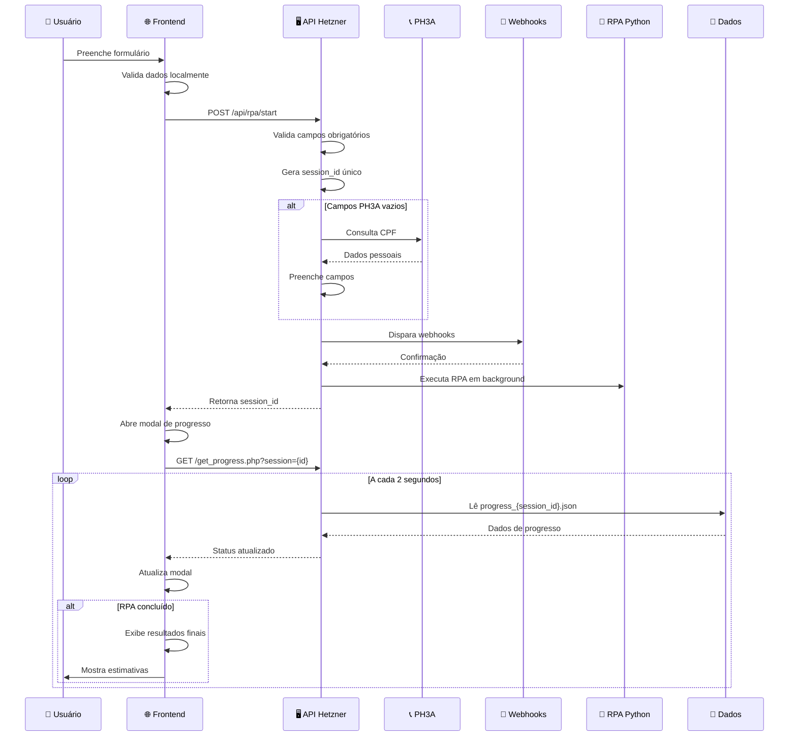
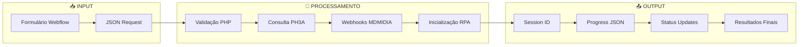
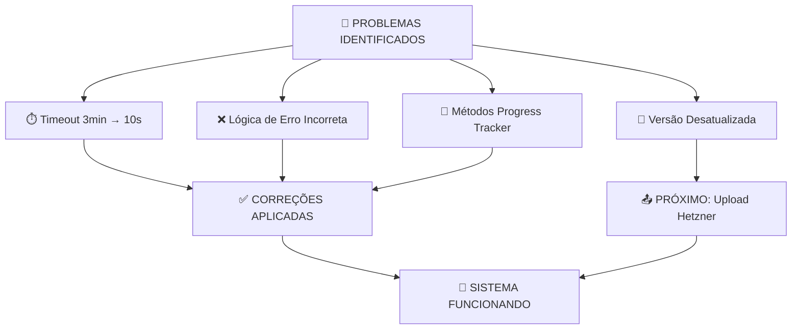

# 🏗️ DIAGRAMA DA ARQUITETURA API HETZNER

```mermaid
graph TB
    %% Frontend Layer
    subgraph "🌐 FRONTEND (Webflow)"
        A[Formulário de Cotação] --> B[JavaScript Injetado]
        B --> C[Coleta de Dados]
        C --> D[Validação Local]
    end
    
    %% API Layer
    subgraph "🖥️ API HETZNER (37.27.92.160)"
        E[start.php] --> F[Validação de Campos]
        F --> G[Geração Session ID]
        G --> H[Consulta PH3A]
        H --> I[Execução Webhooks]
        I --> J[Inicialização RPA]
        
        K[get_progress.php] --> L[Leitura Progress JSON]
        L --> M[Retorno Status]
    end
    
    %% RPA Layer
    subgraph "🤖 RPA PYTHON"
        N[executar_rpa_imediato_playwright.py] --> O[15 Telas Sequenciais]
        O --> P[Progress Tracker]
        P --> Q[Captura de Dados]
        Q --> R[Tratamento de Erros]
    end
    
    %% External Services
    subgraph "🌍 SERVIÇOS EXTERNOS"
        S[API PH3A] --> T[Validação CPF]
        U[Webhooks MDMIDIA] --> V[Integração CRM]
    end
    
    %% Data Storage
    subgraph "💾 ARMAZENAMENTO"
        W[Progress JSON Files] --> X[rpa_data/progress_*.json]
        Y[Session Files] --> Z[sessions/{id}/status.json]
        AA[Logs] --> BB[logs/rpa_*.log]
    end
    
    %% Connections
    D -->|POST /api/rpa/start| E
    E -->|GET /get_progress.php| K
    K -->|Polling 2s| B
    
    H -->|HTTP Request| S
    I -->|HTTP Request| U
    
    J -->|Background Process| N
    P -->|Write| W
    P -->|Write| Y
    R -->|Write| AA
    
    %% Styling
    classDef frontend fill:#e1f5fe
    classDef api fill:#f3e5f5
    classDef rpa fill:#e8f5e8
    classDef external fill:#fff3e0
    classDef storage fill:#fce4ec
    
    class A,B,C,D frontend
    class E,F,G,H,I,J,K,L,M api
    class N,O,P,Q,R rpa
    class S,T,U,V external
    class W,X,Y,Z,AA,BB storage
```

## 🔄 FLUXO DETALHADO DE EXECUÇÃO



## 📊 ESTRUTURA DE DADOS



## 🚨 PONTOS CRÍTICOS


