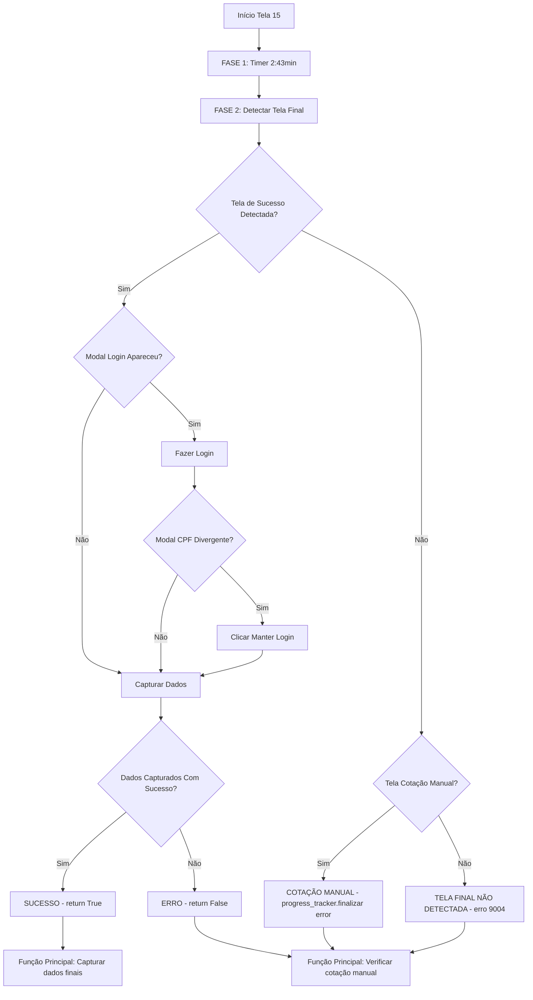

# 📊 Diagrama: Detecção da Tela de Valores Finais

## 🎯 **Fluxo da Tela 15 - Detecção de Valores Finais**

### 🔍 **Como Visualizar com Zoom:**
- **Cursor**: Ctrl+Shift+P → "Mermaid Preview" → Use Ctrl+Scroll para zoom
- **GitHub**: Clique no diagrama para abrir em tela cheia
- **Mermaid Live**: https://mermaid.live/ → Cole o código → Use zoom do navegador
- **VS Code**: Ctrl+K V → Clique direito no diagrama → "Open Preview to the Side"



## 🔧 **Elementos Críticos da Detecção**

### **1. ⏱️ Timer Regressivo (163 segundos)**
- **Modal**: `"Por favor, aguarde. Estamos buscando o corretor ideal para você!"`
- **Timer**: `"Tempo estimado em"`
- **Duração**: 2 minutos e 43 segundos

### **2. 🎯 Detecção da Tela de Sucesso**
- **Seletor**: `"text=Parabéns, chegamos ao resultado final da cotação!"`
- **Timeout**: 10 segundos
- **Status**: ✅ **Tela principal dos planos carregada**

### **3. 📧 Modal de Login (Opcional)**
- **Seletor**: `"text=Acesse sua conta para visualizar o resultado final"`
- **Email**: `#emailTelaLogin`
- **Senha**: `#senhaTelaLogin`
- **Botão**: `#gtm-telaLoginBotaoAcessar`

### **4. 🔐 Modal CPF Divergente (Opcional)**
- **Seletor**: `"text=CPF informado não corresponde à conta"`
- **Botão**: `#manterLoginAtualModalAssociarUsuario`

### **5. 📊 Captura de Dados**
- **Função**: `capturar_dados_planos_seguro(page, parametros_tempo)`
- **Estratégia**: Abordagem híbrida (seletores + texto + regex)
- **Retorno**: Dicionário estruturado com planos

### **6. 📞 Detecção de Cotação Manual**
- **Seletor**: `p.text-center.text-base`
- **Texto**: `"Ops, ainda não encontramos resultados para você"`
- **Timeout**: 10 segundos
- **Ação**: `progress_tracker.finalizar('error')`

## 🎯 **Fluxos de Retorno**

### **✅ Sucesso**
```python
return True
# → Função principal captura dados finais
# → progress_tracker.finalizar('success', dados_planos)
```

### **❌ Cotação Manual**
```python
progress_tracker.finalizar('error', None, "Cotação manual necessária")
return False
# → Função principal detecta cotação manual
# → Retorna erro específico
```

### **❌ Tela Final Não Detectada**
```python
return criar_retorno_erro_tela_final_nao_detectada(...)
# → Erro 9004
# → Mensagem: "Infelizmente não foi possível..."
```

## 🔍 **Pontos Críticos**

1. **Timeout Otimizado**: 10 segundos para detecção da tela de sucesso
2. **Detecção Precisa**: Texto específico para cotação manual
3. **Captura Robusta**: Abordagem híbrida para dados dos planos
4. **Progress Tracker**: Atualizado em cada etapa crítica
5. **Retorno Estruturado**: Diferentes tipos de retorno para diferentes cenários

## 📋 **Resumo da Lógica**

A função `navegar_tela_15_playwright` implementa um fluxo robusto que:
- Aguarda o timer regressivo de 2:43 minutos
- Detecta a tela de valores finais em até 10 segundos
- Trata modais de login e CPF divergente quando necessário
- Captura dados dos planos com estratégia híbrida
- Retorna status apropriado para o progress tracker
- Trata erros específicos (cotação manual, tela não detectada)
