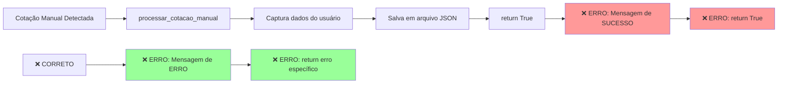
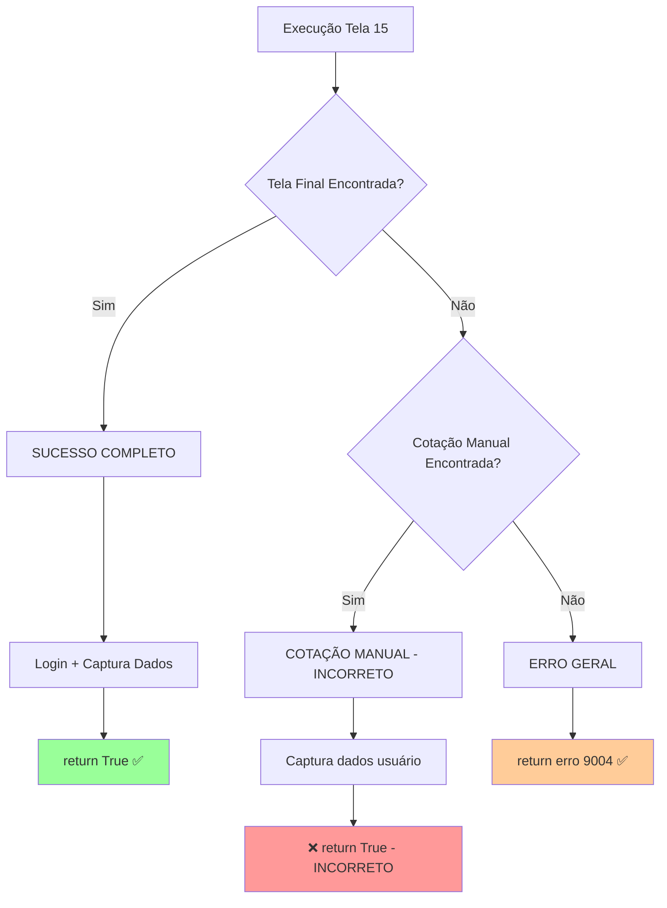
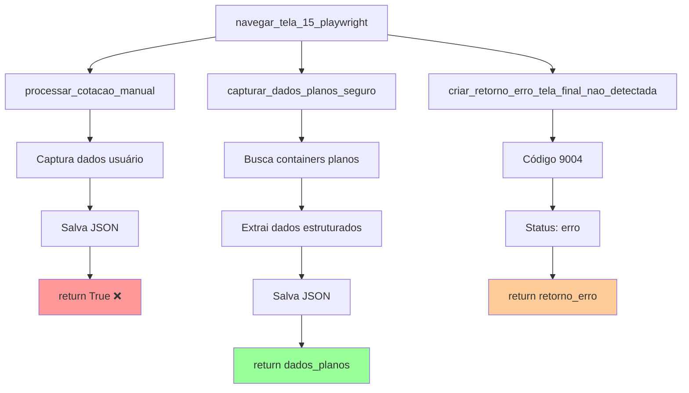

# Diagrama de Execução - Tela 15

## Fluxo Principal

```mermaid
flowchart TD
    A[INÍCIO: navegar_tela_15_playwright] --> B[FASE 1: Timer Regressivo]
    
    B --> C{Aguardar Modal Timer<br/>5s timeout}
    C -->|Encontrado| D[Aguardar Timer 163s]
    C -->|Não encontrado| D
    D --> E[FASE 1 CONCLUÍDA]
    
    E --> F[FASE 2: Buscar Tela Final]
    F --> G{Buscar: "Parabéns, chegamos ao resultado final da cotação!"<br/>180s timeout}
    
    G -->|✅ ENCONTRADO| H[FLUXO DE SUCESSO]
    G -->|❌ TIMEOUT| I[FLUXO DE EXCEÇÃO]
    
    H --> J{Aguardar Modal Login<br/>10s timeout}
    J -->|Encontrado| K[Processar Login]
    J -->|Não encontrado| L[Capturar Dados Planos]
    K --> L
    L --> M[return True ✅]
    
    I --> N{Buscar Cotação Manual<br/>10s timeout}
    N -->|Encontrado| O[🚨 PROBLEMA IDENTIFICADO]
    N -->|Não encontrado| P[return erro 9004]
    
    O --> Q[processar_cotacao_manual]
    Q --> R[❌ ERRO: "[OK] COTAÇÃO MANUAL PROCESSADA COM SUCESSO!"]
    R --> S[❌ ERRO: return True]
    
    style O fill:#ff9999
    style R fill:#ff9999
    style S fill:#ff9999
    style M fill:#99ff99
    style P fill:#ffcc99
```

## Problemas Identificados



## Fluxos Possíveis



## Funções Auxiliares



## Correções Necessárias

```mermaid
flowchart LR
    A[Linha 4021] --> B[Mensagem Atual:<br/>"[OK] COTAÇÃO MANUAL PROCESSADA COM SUCESSO!"]
    B --> C[❌ INCORRETO]
    C --> D[Correção:<br/>"[ERRO] COTAÇÃO MANUAL NECESSÁRIA!"]
    
    E[Linha 4022] --> F[Retorno Atual:<br/>return True]
    F --> G[❌ INCORRETO]
    G --> H[Correção:<br/>return erro específico código 9003]
    
    I[Lógica Conceitual] --> J[Cotação Manual = Sucesso]
    J --> K[❌ INCORRETO]
    K --> L[Correção:<br/>Cotação Manual = Erro do Sistema]
    
    style C fill:#ff9999
    style G fill:#ff9999
    style K fill:#ff9999
    style D fill:#99ff99
    style H fill:#99ff99
    style L fill:#99ff99
```
